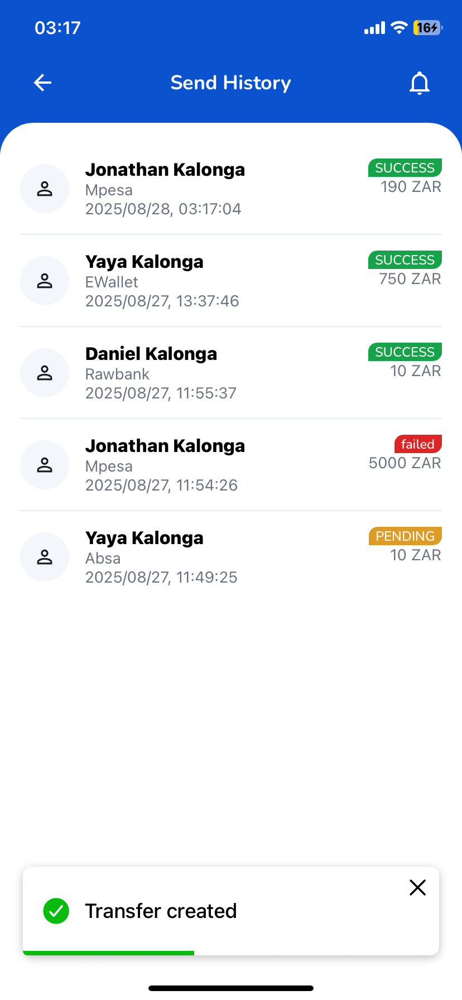

# Fullstack Assessment - Beni KALONGA

https://github.com/minitmoney/fullstack-test
Building both a mobile app and a web dashboard using the designs provided.
### Quick Demo
https://github.com/user-attachments/assets/80521258-aba6-4202-851e-f03c6f84a0d7

### Mobile (Expo)

Expo React Native + TypeScript + Apollo + Axios + SecureStore

## Start the mobile app

```bash
cd mobile
npm install
npm start
```

I am using the expo config to get the iP
Emulator/Simulator or Expo Go. For real device,
If need to be tested on real device, set `API_BASE` in `lib/config.ts` to your machine IP.

### Web (Vite)

React + Vite + Chakra UI + Apollo + Router

## Start the web dashboard

```bash
cd web
npm install
npm run dev
```

### Server

Node + Apollo GraphQL + REST

## Start the server

```bash
cd server
npm install
npm run dev
```

## Bonus

## Mobile

- Added custom fonts on the mobile App
- Added A Network State Listener for connectivity
- Added a Splashscreen

## WEB

- Added A login Page for the Admin Dashboard,
- Support Light/Dark mode

## SERVER

- Using a json file as db
- using a rest api to get the rate

## Suggestions

- Add Subscription to listen to any transaction event on the Dashboard
- Connect to a DB

Open http://localhost:4000/graphql. for ApolloServer and test

Open http://localhost:5000.
The app will take you to Login page `/login`, use seeded credentials **Register a user on the device to get credentials**.

Install and the mobile App using Expo Go, .

if having dependencies version conflict, please run **npm install --legacy-peer-deps**

Please see the result in `./results` directory
Screenshots for the entire system

# RESULT

## MOBILE

**1** 
**2** 
**3** 
**4** 
**5** 
**6** 
**7** 

## WEB

**1** 
**2** 
**3** 
**4** 
**5** 

## SERVER


